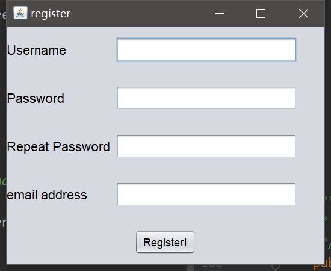
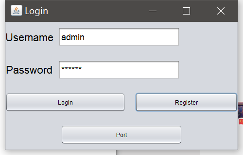
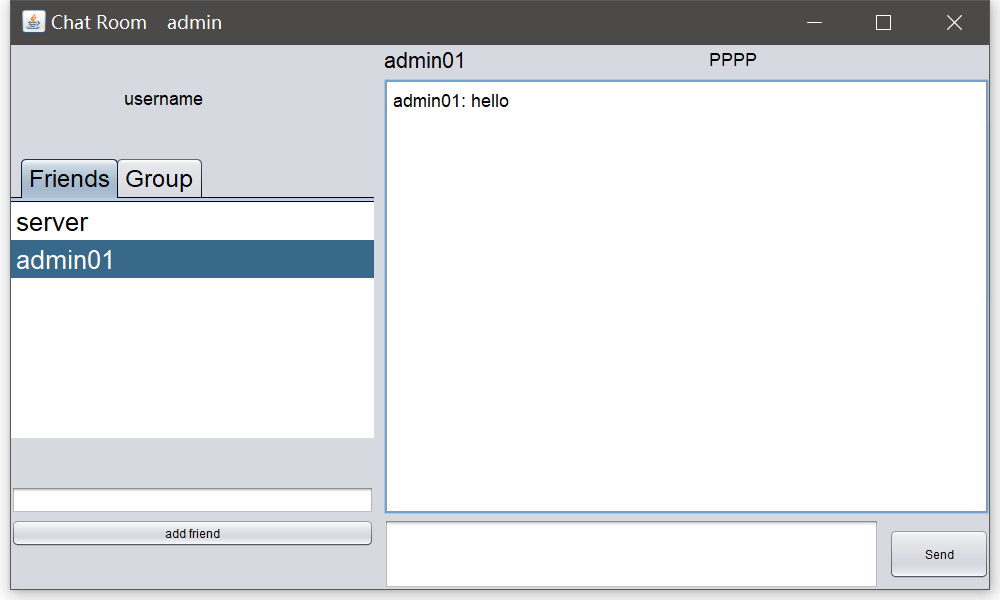
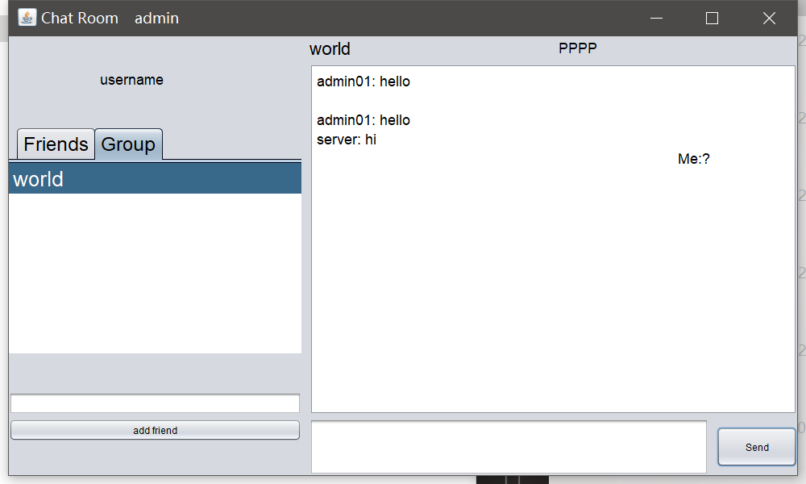
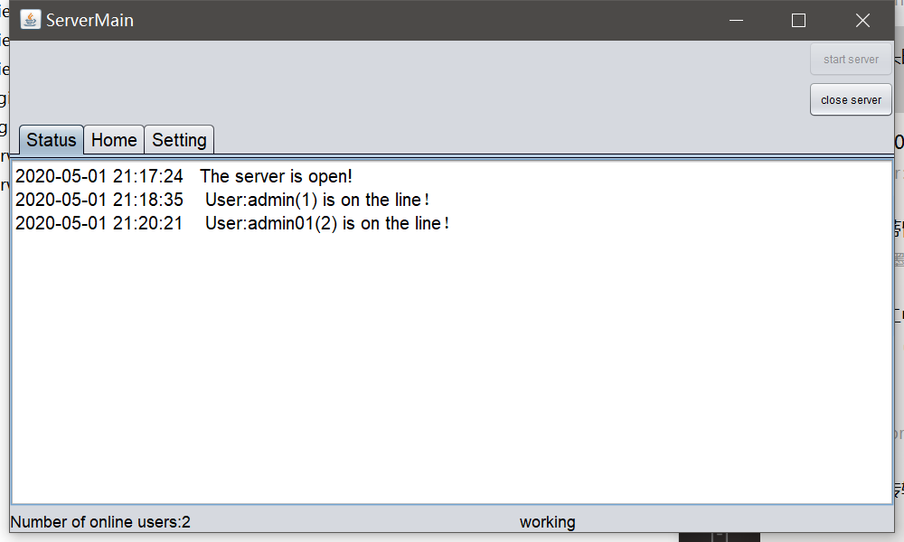
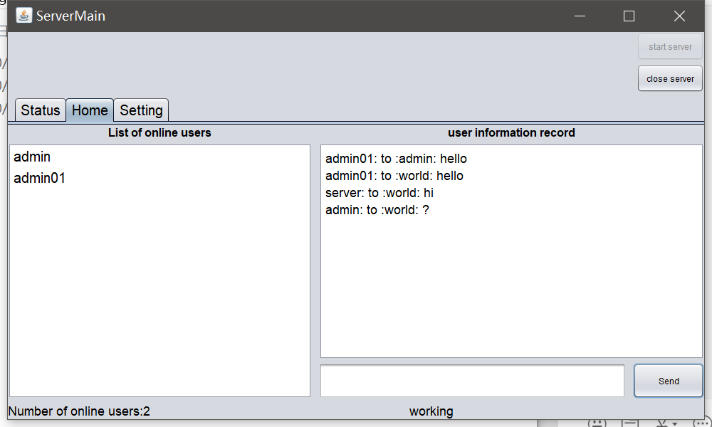

# TCP-Based ChatRoom
*This is a network course project.*

###Technicals
- IDE:Idea
- GUI: IDEA GuiForm
- Manage Project: Maven
- Version control: github
## Functionality

#### Register
- A user can register a username and password in the database, but the server will check if this username exists in the database.

- 

#### Login
- Login into system by the username and password. At the login window, the user can also chose to register a username or select the port
and the IP address of the server.
- If login failed, the server will return the reason of why failed.

- 
#### Add Friend
- After user login into the system, user can add a friend by username. If this process is allowed by the server, the friend's username will
appear on the friend list.
#### Private Message
- This program allows a user to send and receive message to and from a remote friend's user.

- 
#### Group Message
- This program allows a user to send and receive message to and from a group and all the users in this group can receive this message.

- 
#### Count the number of users online
- On the server side, the server can count the number of online users.
#### Show login info
- On the server side, server can monitor all the login info.

- 
#### Start/Stop the server
- On the server window, server can choose to open or close manually.
#### Send system info
- The server can send system info from the server by using the name "server". And this message will be shown 
in the "world" group.

- 
---
## Server

### start server
1. use the ServerSocket API:
    - This class implements server sockets. 
    - A server socket waits for requests to come in over the network. 
    - It performs some operation based on that request, and then possibly returns a result to the requester.
2. Start server
    - When ServerMain() method is running and we click the start button,the serverSocket will be passed to ServerThread.
3. serverThread
    - The serverSocket call accept() method to listen for a connection to be made to this socket and accepts.
    - If the serverSocket does not accept any connection request, it will congest itself until a connection request comes.
    The method serverSocket.accept() will return a new socket. And the sever will use this new socket to talk with the client.
    
### ServerReceiveThread
1. What is ServerReceive?
    - when serverThread.accept() returns a new socket, server will create a new thread which is serverReceiveThread. Each username or client matches a
     single serverReceiveThread. 
2. What does serverReceiveThread do?
    - This thread receives all the massage from the specified username/client/socket.
    - When thread receive the message it will forward all the personal and group message to the getters. 
    - This thread also can call other user user's serverReceiveThread to forward the massage.
    
### ServerCollection
*The ServerCollection class is used for storing a map to record the username and its Thread.*
- While any serverReceiveThread want to call the other user's thread, it has to use the **ServerCollection** class.

1. Method:
    - public static void add(String username, ServerReceiveThread serverReceiveThread): This method is used to add a new serverReceiveThread
    to the ServerCollection.
    - public static ServerReceiveThread get(String username): Get the serverReceiveThread by using the account name;
    - public static void remove(String username): Delete the serverReceiveThread by its username and set the user's status offline.
    - Ect.
---

## Message

### Type
1. addFriendRequest/addFriendResponse:
    - This type is used while client request for adding a friend.
    - For the client, the content should be the name of the friend.
    - For the server response, the content should be **"disagree"** representing that this friend name not exist in the database or is invalid name, or **friend name** if server agree to add this friend into both users' database.
    - This request/response is processed in the ServerThread.
2. loginRequest/loginResponse:
    - This type is used while user login.
    - For the client, the content should be the **username** and **password**.
    - for the server, the content should be flowing if agree: 1. agree 2. user's friend list 3. user's group list
    or if disagree: 1. disagree 2. reason(error code: 1 for wrong username and 2 for this username is login).
    - This request/response is processed in the ServerThread.
3. personal:
    - This type is used while oen user want to send message to another user.
    - The sender should be the username sending message.
    - The getter should be the username get this message.
    - The content should be the text sender want to send.
    - This request/response is processed in the ServerThread.
4. group:
    - This type is used while user want to send a message to a group.
    - The sender should be the username sending message.
    - The getter should be the group name.
    - The content should be the text sender want to send.
    - This request/response is processed in the ServerThread.
    
---
## Client
*Client includes all the tools to be used in the client.*
### Login
- When user login, it will send a message with Type "loginRequest" to the server. If the server response "agree", the user can get the friends list and
group list in the content of response message. And then call the Main() method to turn to the Client window.
### Main
- At the beginning of the Main() method, this method will load the friends list and the group list onto the window.
- Then this method calls the ClientReceiveThread to receive and send message to and from the server.
### ClientReceiveThread
- Each client maintains only one ClientReceiveThread. While the client need to send the message to someone or a group, this thread
will just write the message into the OutputStream and this thread will read from the InputStream ot get the message to this socket/client while
receiving message from server. This thread can de-encapsulate the message and put it into the main window.
### AddFriend
- This class set a message with the type of "addFriendRequest" and the content is the name of the friend want to be added. If the server allows this 
operation, ClientReceiveThread will receive a message with the type "addFriendResponse" from server. And the server will change both users' database. 
